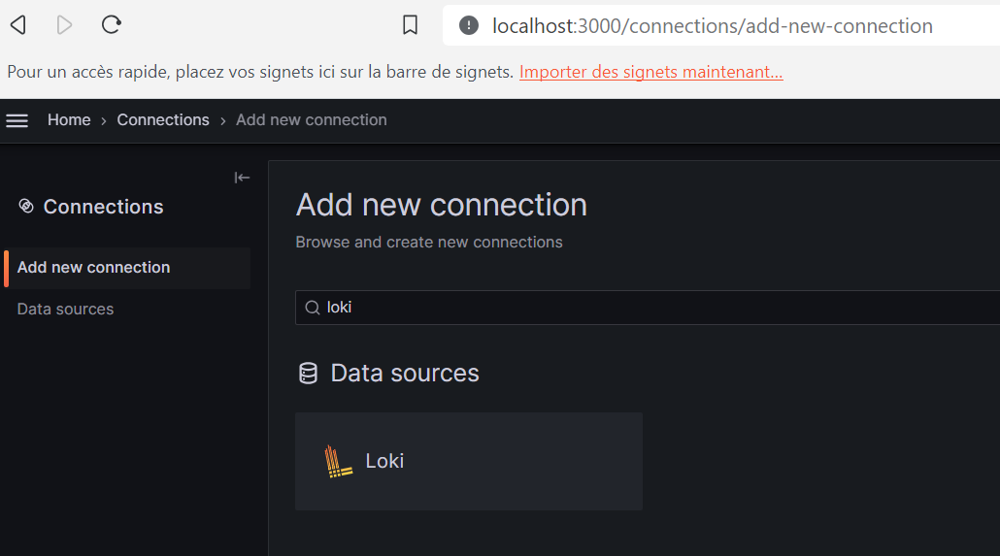
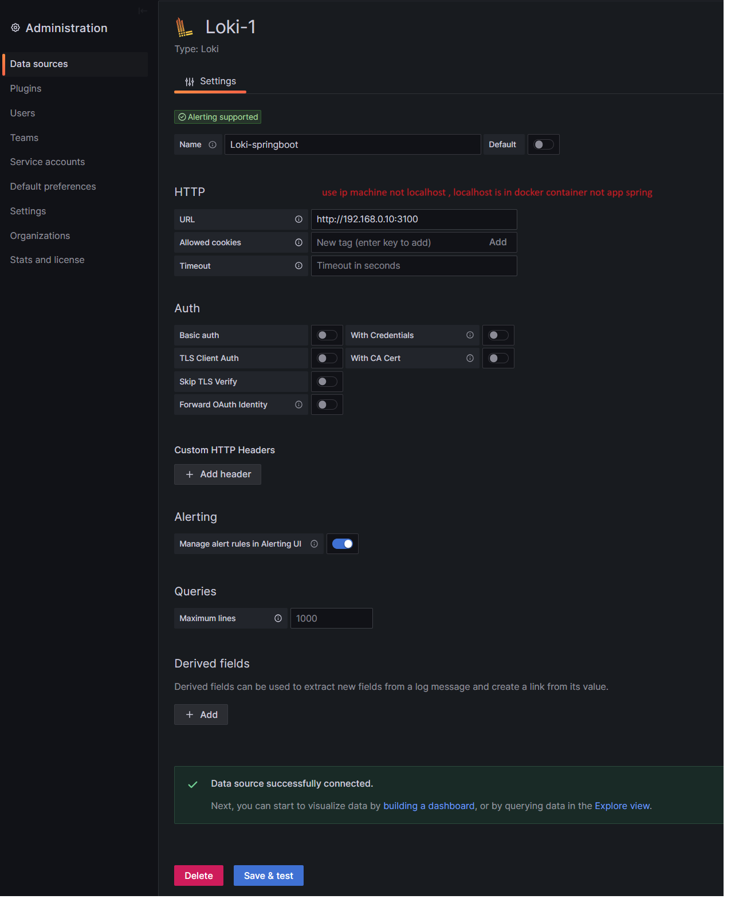
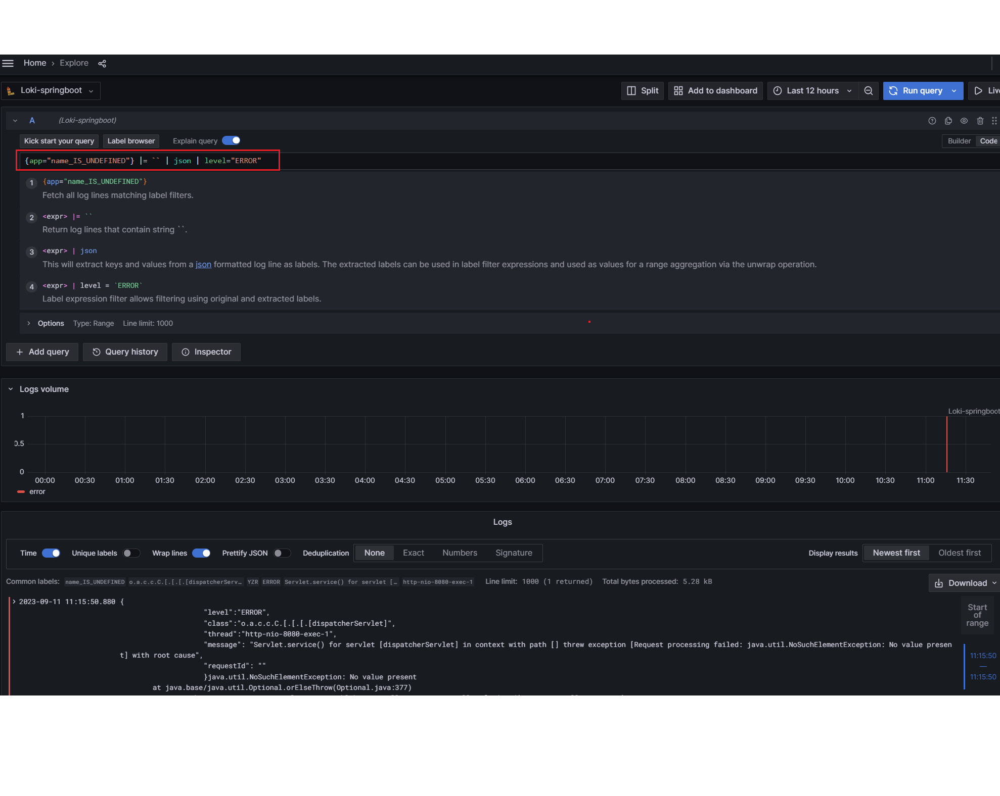
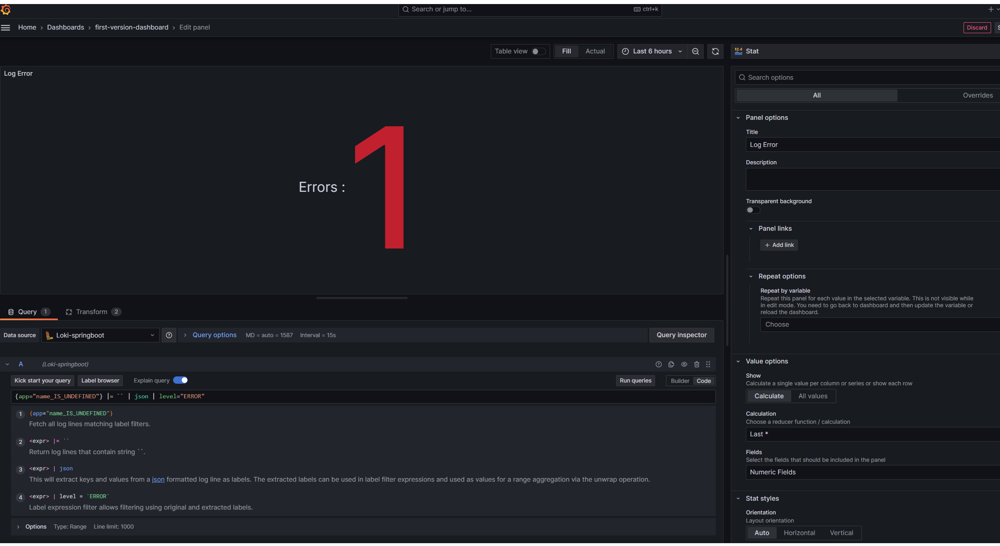

## Logging in Spring Boot with Loki

Then we need to create the logback-spring.xml file in the src/main/resources directory.
Our instance of Loki is available under the http://localhost:3100 address (1).
Loki does not index the contents of the logs – but only metadata labels.
There are some static labels like the app name, log level, or hostname.
We can set them in the format.label field (2).
We will also set some dynamic labels and therefore we enable the Logback markers feature (3).
Finally, we are setting the log format pattern (4).
In order to simplify, potential transformations with LogQL (Loki query language) we will use JSON notation.

````xml
<?xml version="1.0" encoding="UTF-8"?>
<configuration>

  <springProperty name="name" source="spring.application.name" />

  <appender name="CONSOLE" class="ch.qos.logback.core.ConsoleAppender">
    <encoder>
      <pattern>
        %d{HH:mm:ss.SSS} %-5level %logger{36} %X{X-Request-ID} - %msg%n
      </pattern>
    </encoder>
  </appender>

  <appender name="LOKI" class="com.github.loki4j.logback.Loki4jAppender">
    <!-- (1) -->
    <http>
      <url>http://localhost:3100/loki/api/v1/push</url>
    </http>
    <format>
      <!-- (2) -->
      <label>
        <pattern>app=${name},host=${HOSTNAME},level=%level</pattern>
        <!-- (3) -->
        <readMarkers>true</readMarkers>
      </label>
      <message>
        <!-- (4) -->
        <pattern>
{
   "level":"%level",
   "class":"%logger{36}",
   "thread":"%thread",
   "message": "%message",
   "requestId": "%X{X-Request-ID}"
}
        </pattern>
      </message>
    </format>
  </appender>

  <root level="INFO">
    <appender-ref ref="CONSOLE" />
    <appender-ref ref="LOKI" />
  </root>

</configuration>
````

### Run application 

````shell
docker compose up
````
or
````shell
mvn spring-boot:run
````

````text
10:52:39.988 INFO  o.s.b.docker.compose.core.DockerCli  - Container log-spring-with-loki-grafana-1  Waiting
10:52:40.477 INFO  o.s.b.docker.compose.core.DockerCli  - Container log-spring-with-loki-loki-1  Healthy
10:52:40.566 INFO  o.s.b.docker.compose.core.DockerCli  - Container log-spring-with-loki-grafana-1  Healthy
10:52:51.359 INFO  o.s.b.w.e.tomcat.TomcatWebServer  - Tomcat initialized with port(s): 8080 (http)
10:52:51.380 INFO  o.a.coyote.http11.Http11NioProtocol  - Initializing ProtocolHandler ["http-nio-8080"]
10:52:51.384 INFO  o.a.catalina.core.StandardService  - Starting service [Tomcat]
10:52:51.385 INFO  o.a.catalina.core.StandardEngine  - Starting Servlet engine: [Apache Tomcat/10.1.12]
````

````shell
$ docker container ls
````

````text
CONTAINER ID   IMAGE                    COMMAND                  CREATED          STATUS          PORTS                    NAMES
20b9f5cf9da7   grafana/grafana:latest   "sh -euc 'mkdir -p /…"   44 seconds ago   Up 40 seconds   0.0.0.0:3000->3000/tcp   log-spring-with-loki-grafana-1
dd2ea713e271   grafana/loki:2.8.2       "/usr/bin/loki -conf…"   44 seconds ago   Up 40 seconds   0.0.0.0:3100->3100/tcp   log-spring-with-loki-loki-1

````

### Testing Logging on the Spring Boot REST App
After running the app, we can make some test calls of our REST API. In the beginning, let’s add some persons
````shell
$ curl 'http://localhost:8080/persons' \
  -H 'Content-Type: application/json' \
  -d '{"firstName": "AAA","lastName": "BBB","age": 20,"gender": "MALE"}'

$ curl 'http://localhost:8080/persons' \
  -H 'Content-Type: application/json' \
  -d '{"firstName": "CCC","lastName": "DDD","age": 30,"gender": "FEMALE"}'

$ curl 'http://localhost:8080/persons' \
  -H 'Content-Type: application/json' \
  -d '{"firstName": "EEE","lastName": "FFF","age": 40,"gender": "MALE"}'
````
````text
10:54:42.924 INFO  c.z.p.m.l.c.PersonController  - New person successfully added
10:54:56.121 INFO  c.z.p.m.l.c.PersonController  - New person successfully added
10:55:11.426 INFO  c.z.p.m.l.c.PersonController  - New person successfully added
````

Then, we may call the “find” endpoints several times with different criteria:

````shell
$ curl http://localhost:8080/persons/1
$ curl http://localhost:8080/persons/2
$ curl http://localhost:8080/persons/3
````

Add datasource Loki


Config datasource connection






